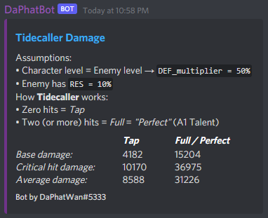

<!-- Available commands -->
## Available Commands
#### Primary Utility
* `p!help`
  * Display available commands in Discord chat  
#### General DPS Calculator commands
* `p!damage ATK DMG% CRate CDmg [RES_Mult [DEF_Mult]]`
  * Gets expected output damage, ignoring talents
* `p!extraATK baseATK 4NO pyro TToDS`
  * Gets common, *external* ATK% buffs (4NO, pyro resonance, TToDS)
  * Click [here](https://github.com/Wrthlor/DaPhatBot/blob/master/src/main/java/com/github/wrthlor/daphatbot/genshin/Images/CalculatingAdditionalAttack.png)
  to learn how to calculate additional ATK% buffs
* `p!calcRES Enemy_RES`
  * Gets enemy resistance multiplier
* `p!calcDEF Char_lvl Enemy_lvl [DEF_Reduction]`
  * Gets enemy defense multiplier

#### Beidou Specific commands
* `p!parry ATK DMG% CRate CDmg Talent_lvl [RES_Mult [DEF_Mult]]`
  * Gets expected Tidecaller damage
* `p!ult ATK DMG% CRate CDmg Talent_lvl [RES_Mult [DEF_Mult]]`
  * Gets expected Stormbreaker damage

<!-- Samples -->
## Sample Output Images
#### Calculating *Tidecaller* damage 

* User provides input: `p!parry 1941 85.6 73.6 143.2 13`

#### Calculating *Stormbreaker* damage

* User provides input: `p!ult 1941 115.6 73.6 143.2 13`