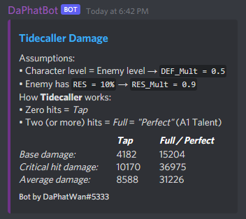
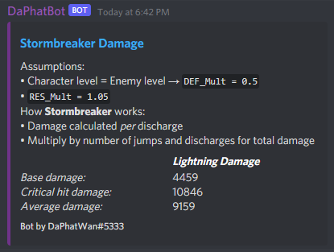

## Sample Images

### Calculating *Tidecaller* damage 

* User provides input: `p!parry 1941 85.6 73.6 143.2 13`

### Calculating *Stormbreaker* damage

* User provides input: `p!ult 1941 115.6 73.6 143.2 13`